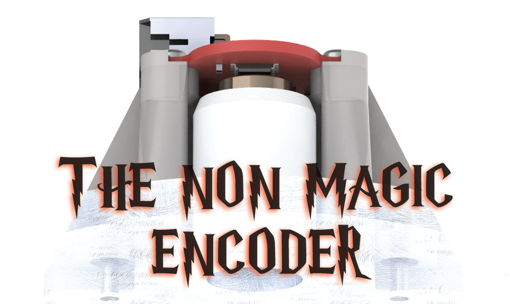
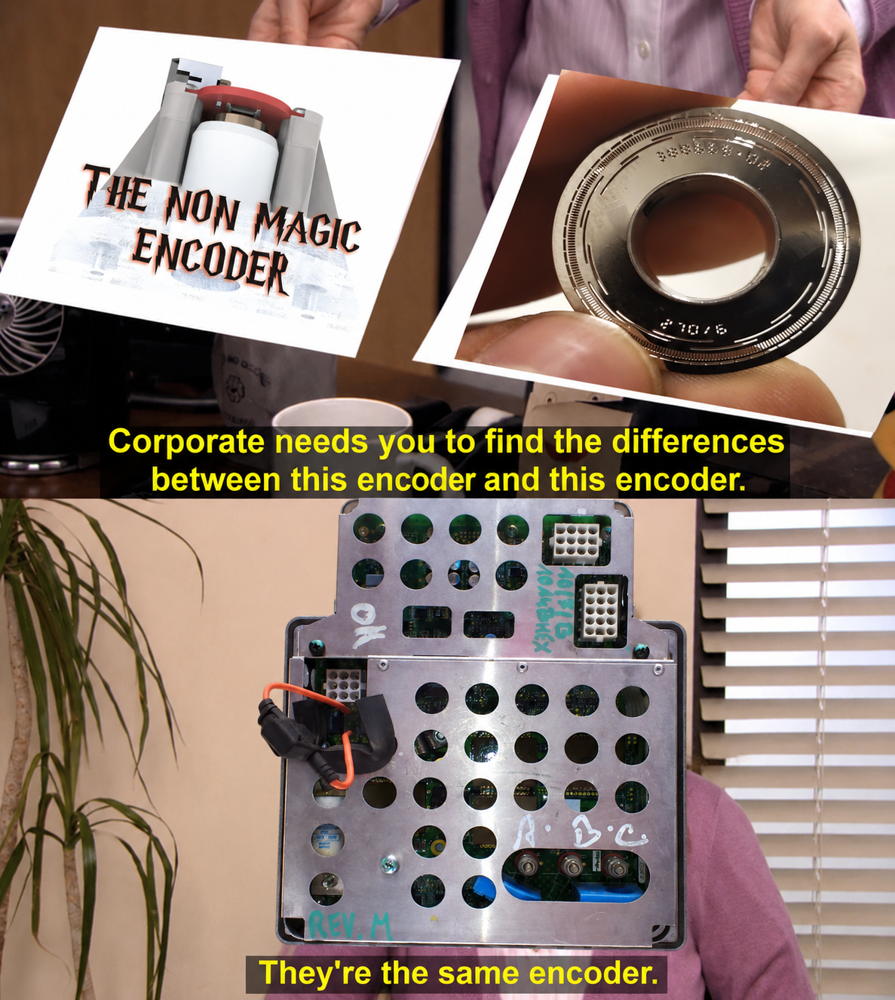
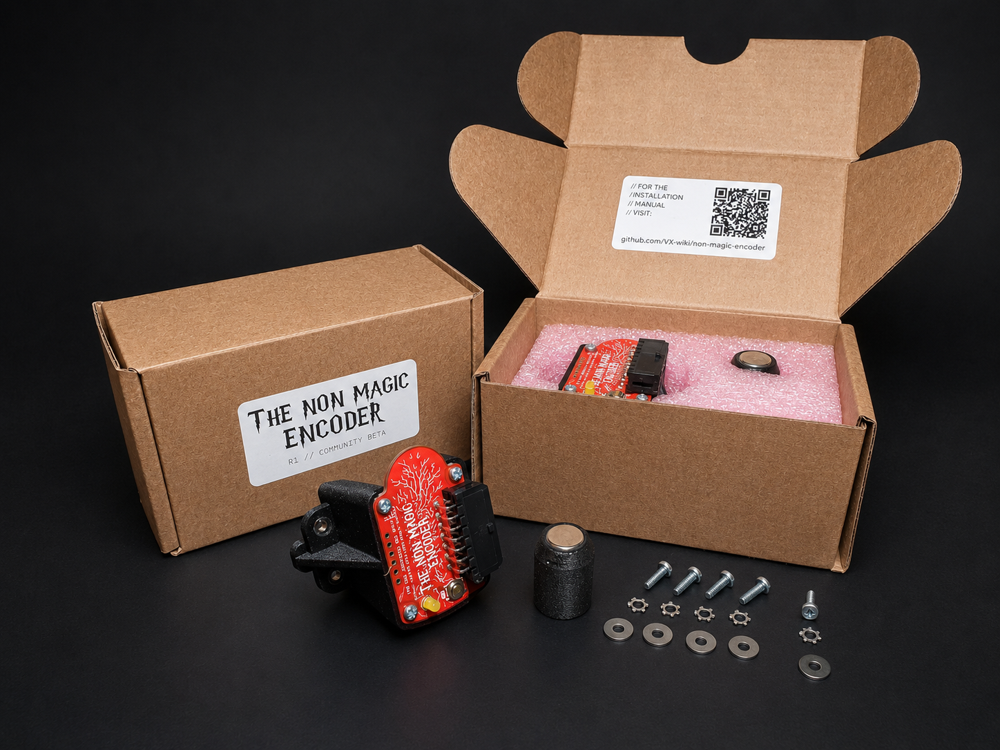
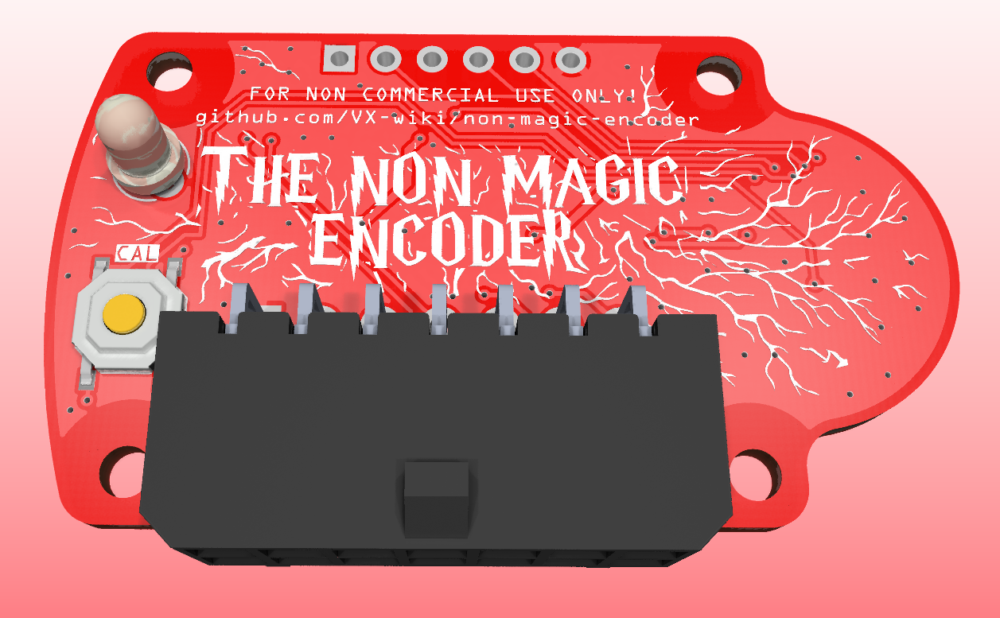
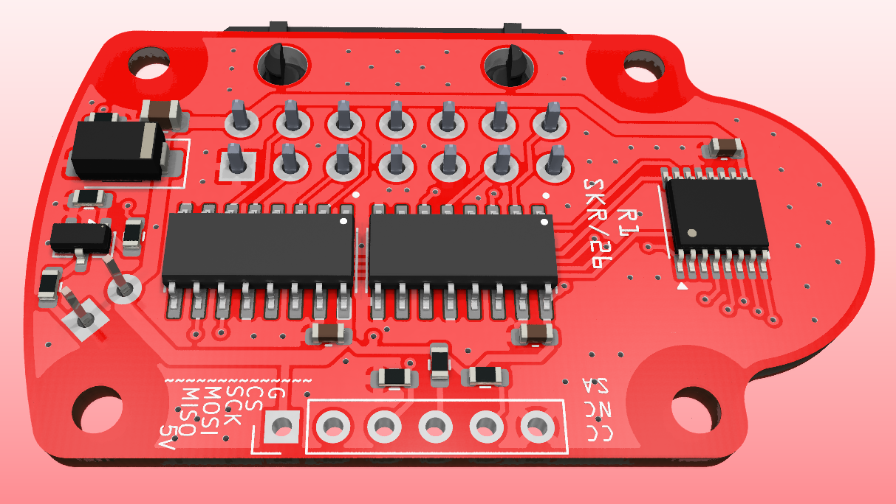
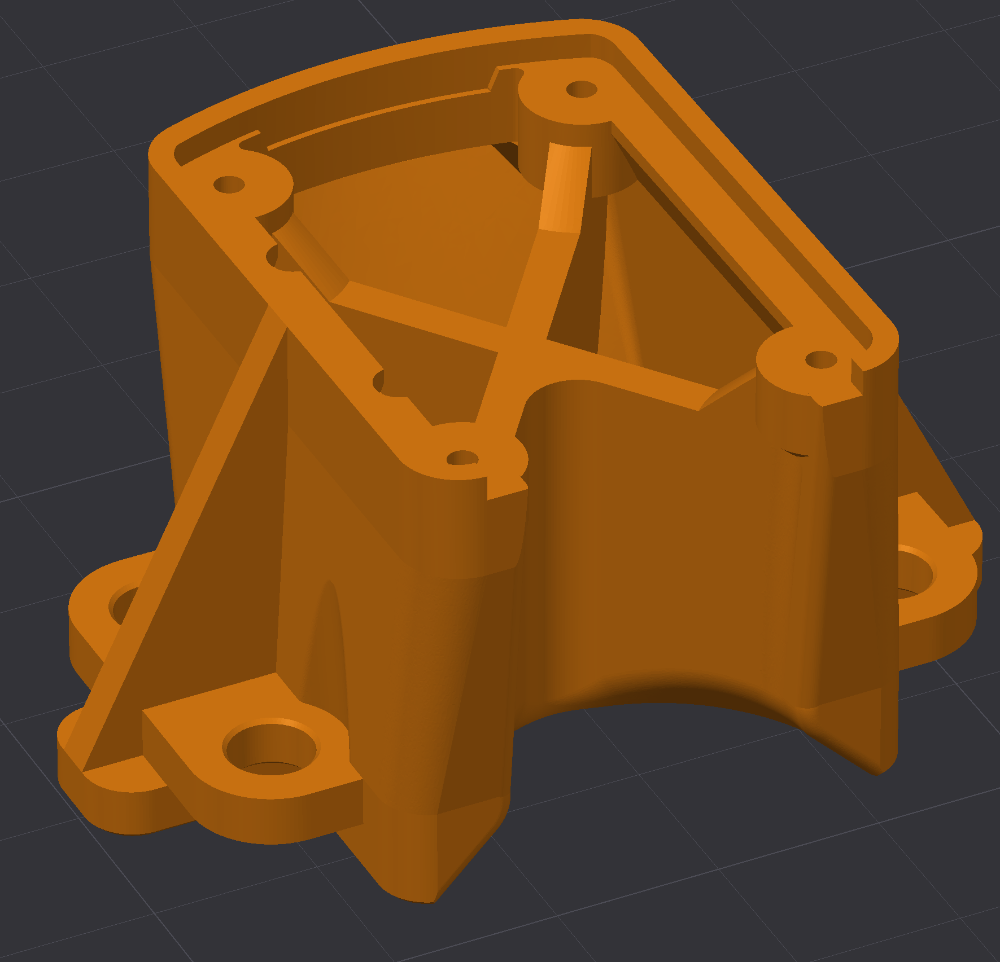
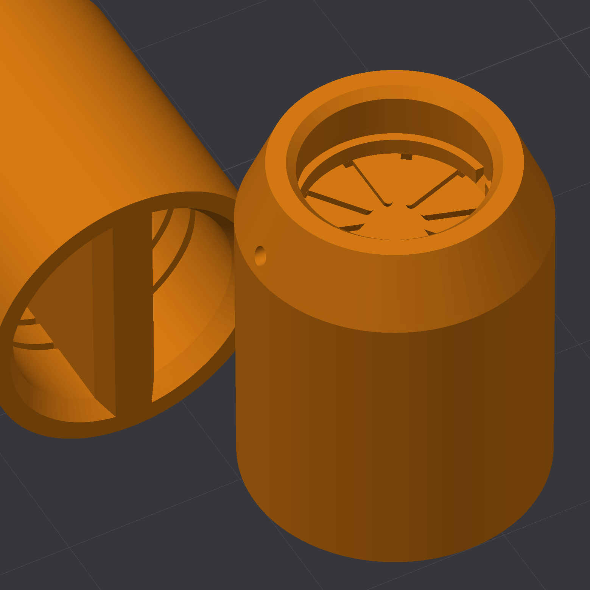
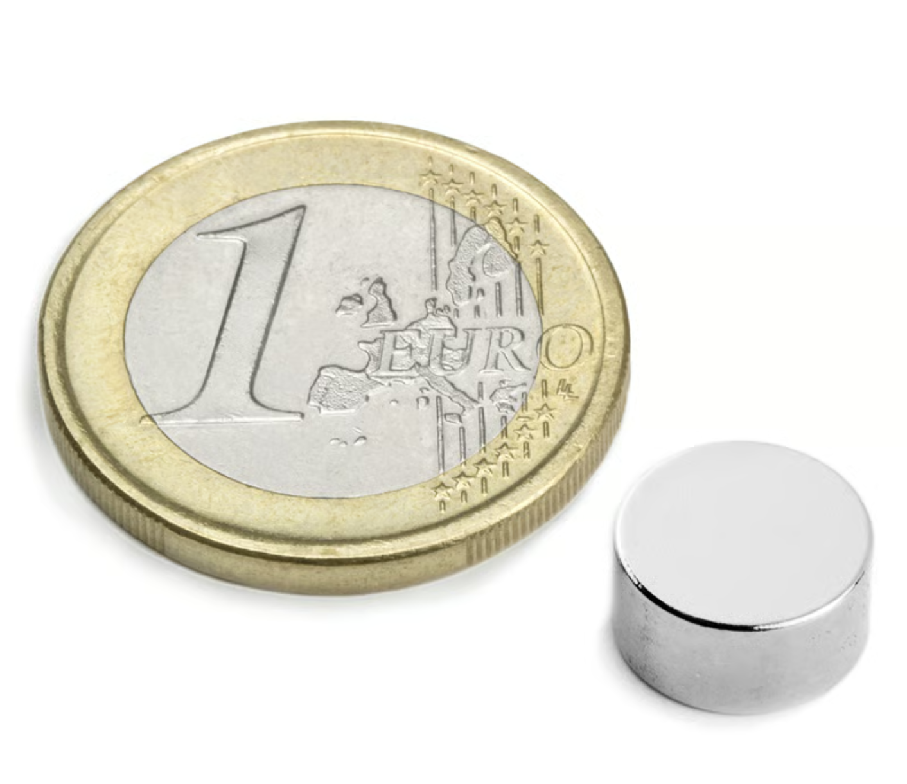

# Non-Magic Encoder

> ### ⚠️ Read this first: do you actually need one?
>
> **The stock Broadcom optical encoder is magically good when it works.** It is accurate, clean, and there is genuinely nothing wrong with it. Its *only* real weakness is that it is **mechanically fragile**: a delicate optical disc, optics, and aging plastic living in a hot, vibrating drivetrain. If your optical encoder is healthy, **leave it alone**. Nothing here will beat it.
>
> **Non-Magic has no magical properties.** Per the comparison report it does an essentially **identical job**: same current per torque, same heat, same efficiency. It will **not** make your scooter faster, more efficient, or smoother. Treat any apparent "improvement" as noise until proven otherwise.
>
> **This is still hardware under active test.** Non-Magic R1 is community beta with limited hours on a single bike. A lot can still go wrong: installation, adhesives, alignment, calibration, and long-term durability are all unproven at scale. The *one* thing it is meant to bring, better mechanical robustness from having no fragile optical disc, is **plausible but unproven**, and only earns that title after years of real-world service. The only honest reason to fit one today is that your optical encoder has already failed, or you are deliberately experimenting and accept the risk.

  

## Status and scope

Non-Magic R1 is **community-beta DIY hardware that is still actively under test.**

It has been bench-tested and road-tested on the author's single Vectrix VX-1 and, in those limited conditions, has shown no measurable power, efficiency, current, or heat penalty versus the OEM optical encoder. That is the *whole* of the evidence so far: one bike, a modest number of hours, one rider. It is a small-batch maker project, not a mass-produced, durability-qualified, or independently certified vehicle component.

**Expect problems.** Installation, calibration, adhesives, alignment, and long-term durability are all places where it can and may go wrong. The headline claim of better *mechanical robustness* over the optical encoder is plausible but **not yet proven**. It only earns that title after surviving years of heat, vibration, and moisture in service. Until then, assume Non-Magic is, at best, an *equal* to a working optical encoder, with robustness as an unproven bet.

Use it only if you understand the installation, calibration, and testing procedure, and only if you are comfortable being part of that test.

## What is this?

Non-Magic is a calibrated magnetic replacement encoder for the Vectrix VX-1 motor: a practical, mechanically robust drop-in for when the fragile stock optical encoder finally fails.

**Why "Non-Magic"?** There is a lot of magic out there: black-box encoders locked to one motor controller, with proprietary firmware you cannot read, repair, or replace. This is a *non-magical* encoder. It is open hardware you can modify, build, and experiment with as you please.

**Works with any stock motor controller firmware.** Non-Magic fully emulates the original optical encoder's parameters, with line-driver outputs matched to the original. There is nothing to reflash on the controller and no firmware lock-in. It drops in and behaves like the factory encoder. The goal is to **match** the optical encoder from a more mechanically robust platform, not to beat it.

A good encoder matters because the motor controller has to know rotor position before it can switch the windings cleanly. A weak or misaligned encoder can still make the wheel turn, but it can also add current ripple, heat, whine, rough commutation, lower efficiency, and extra stress on the inverter capacitors. The encoder is a small part, but it decides how cleanly the whole motor system works.

The comparison report now covers **two tests**, both against the factory optical encoder on the same stock controller firmware:

- **Bench (no-load).** On the stand, Non-Magic held its own on power and produced a slightly cleaner commutation signature through the main test band, with more sharply defined motor switching, run for run.
- **Road (loaded).** Ridden on public road under real load up to ~110 A, the two encoders were **indistinguishable**: same current for the same torque (within ~1%), the same heat in the inverter and DC-link capacitors, the same cruise/touring consumption (whole-ride energy 689 vs 690 Wh), and the same regen behaviour. The road test closes the bench's main open question: loaded efficiency and component heating.

The honest bottom line: across both tests the calibrated Non-Magic encoder performs **at least as well** as the OEM optical encoder, with no measurable power, efficiency, or heat penalty. "At least as well" is the ceiling of the claim, not a promise of better, and it still rests on a single bike over limited hours. Read the full comparison report here:

[Non-Magic encoder comparison report (rev2: bench + road)](assets/docs/Non-Magic-encoder-comparison-report-rev2-270626.pdf)

## Specifications

| | |
| --- | --- |
| Sensing IC | MT6835, 21-bit high-accuracy magnetic angle encoder |
| Core resolution | 21-bit |
| Accuracy | User auto-calibration with distortion compensation, target INL < ±0.07° |
| Max rotation speed | Up to 120,000 RPM |
| Operating temperature | −40 to +125 °C |
| Output drivers | AM26C31QDR automotive line drivers |
| Output interface | Connections match the original optical encoder |
| Controller firmware | Works with any stock motor controller firmware. Fully emulates the original encoder's parameters, no reflash, no lock-in |
| Mounting | Robust mechanical mount, designed for a hot, vibrating drivetrain |

## Buy DIY Kit

  
   
  self installation required · community-beta, install at your own risk

  <strong>Proceeds support a non-profit makerspace in Riga, Latvia.</strong> 
  The first R1 batch is personally funded by the maintainer; Stripe proceeds after payment processing fees go to the makerspace.

> ⚠️ **DIY community-beta kit: read before buying or building.**
>
> This is a limited R1 DIY repair/experimenter kit for experienced Vectrix VX-1 owners. It is **not** a plug-and-play consumer accessory: not type-approved, not independently safety-certified, and not supplied as a certified road-use safety component.
>
> Installation requires correct mechanical fitment, magnet alignment, adhesive use, wiring, encoder self-calibration, and motor-controller offset calibration. Incorrect installation or calibration can cause rough commutation, loss of propulsion, overheating, motor or controller damage, or unsafe vehicle behaviour.
>
> Buy only if you can install, inspect, calibrate, and test it yourself. Start with the wheel lifted, test gently, and stop using it immediately if you hear abnormal noise, feel rough running, see faults, or notice unusual heat.
>
> Nothing here limits any mandatory rights or remedies that cannot legally be excluded.

Every board is **tested, programmed, and conformal coated** before it ships. The kit includes **all required parts except threadlocker and adhesive** (listed as consumables below).

## PCB

## How to Install and Use

> ⚠️ **Safety first: read before you touch anything.**
>
> - **Always on the centre stand.** Every calibration and test step below is done with the bike on its centre stand and the **driven (rear) wheel off the ground and free to spin**. The motor can spin that wheel on its own during offset calibration, so never do this with the wheel able to drive the bike.
> - **High voltage.** The Vectrix runs on high-voltage traction electronics. Treat the battery, controller, and wiring as live and dangerous at all times, and take every sane high-voltage precaution whenever you work on the bike.

Installation walkthrough video:

https://github.com/user-attachments/assets/6c1a84cd-9490-44e6-9311-1ca9467ff3d4

A key advantage of Non-Magic is that it **self-calibrates once installed**. The on-board MT6835 builds its own angle-error correction map while the rotor turns slowly. You just spin the rear wheel at roughly 5 km/h with a hand drill pressed against the tyre and hold the calibration button. No special rig, no PC required for this step.

### 1. Mechanical installation

1. **Remove the original encoder assembly.**
2. **Clean the area thoroughly.** No dust, grease, oil, or other contaminants may remain in the motor encoder cavity. A clean, dry surface is critical for both the adhesive bond and the magnetic reading.
3. **Install the magnet holder.** Apply adhesive and push the magnet holder on until the motor shaft bottoms out inside it. Watch the slot in the shaft and the magnet holder; they must align cleanly. Allow the adhesive to set if possible.
4. **Attach the encoder assembly to the motor case.** Use threadlocker on the bolts. Fit each bolt with a wide washer and a serrated washer. **Do not overtighten.**
5. **Connect the encoder connector.**

There are **two separate calibrations**, and they must not be confused:

- **Encoder ASIC self-calibration** (Section 2) calibrates the **encoder**. It runs on the encoder's own MT6835 chip and corrects the magnetic sensor's per-revolution angle-error map, using the **encoder's calibration button and LED**.
- **Motor offset calibration** (Section 3) calibrates the **inverter**. It runs on the Vectrix motor controller, either in diagnostic software or via the throttle/brake/ignition "combo", and teaches the controller the fixed angle between encoder zero and the rotor's magnetic zero.

Do both, in this order. They are different procedures on different hardware; the encoder button does not trigger the controller offset cal, and the controller combo does not trigger the ASIC self-cal.

### 2. Encoder ASIC self-calibration (on the encoder)

1. **Power on the bike, but do not try to start it.**
2. **Turn the wheel by hand and watch the LED.** It should give **5 pulses per wheel revolution**. If it does, the magnet and alignment are good.
3. **Run the calibration spin.** Put the bike on the centre stand and spin the rear wheel with a hand drill pressed against the tyre, holding roughly **5 km/h** (read off the dash or scooter diagnostic software).
4. **Hold the calibration button.** Calibration needs **more than 64 rotations** to complete; expect to hold the button for under ~20 seconds. **THE SPEED TARGET IS APPROX 10-30-ish km/h, so no need to be very precise. If you are too slow or fast- it will just fail and let you know with the led** The LED shows progress:

   | LED state | Meaning |
   | --- | --- |
   | Half brightness | Calibration in progress |
   | Dim | Calibration failed |
   | Full on | Calibration succeeded |

5. **Turn the bike fully off** once calibration succeeds.

### 3. Motor offset calibration (on the inverter)

After the on-board self-cal, the motor controller still needs its own encoder-offset calibration.

**With the Vectrix diagnostics software:** turn the bike on and run the encoder calibration from the diagnostic application. Note this needs a **PeakCAN cable** to talk to the controller. If you don't have one, you can't use the software, so use the combo procedure below instead.

**Without software, the built-in combo procedure:** the controller has a hidden calibration mode you trigger straight from the bars, no cable or software required. (This is the same throttle/brake/ignition combo Vectrix documented for the original optical encoder; it works identically here.)

1. Put the bike on its **centre stand** and confirm the rear wheel is off the ground, free to spin, and the bike is stable.
2. Fold up the side-stand / kickstand.
3. Make sure the ignition key is in the **OFF** position.
4. Press the kill switch to the **RUN** position.
5. Turn the throttle **fully open** and squeeze the **left brake** lever, and hold both.
6. While still holding throttle and brake, turn the ignition **ON**.
7. Keep holding until the dashboard activates and the **WRENCH** icon / tell-tale light stays on, then release the throttle and brake.
8. Calibration starts automatically: the wheel begins to rotate and the speedometer needle sweeps from 0 km/h up to 120 km/h and back to zero.
9. After a few seconds the **WRENCH** icon disappears. Calibration is done.
10. If the process repeats itself over and over, the encoder cannot find a valid calibration; it requires inspection, cleaning, or replacement.

> **Caution:** the bike is still in GO mode during and after this procedure. Turning the throttle will activate the motor.

Then test gently first, listening for rough commutation or abnormal motor/controller heat.

> **Note: check your phase wiring.** The author's bike came equipped with a "magic" commercial magnetic encoder as purchased, and its motor phase wires were connected A-B, B-C, C-A. Neither the optical nor the magnetic encoder would work until the phases were swapped back to their respective factory positions: A-A, B-B, C-C. If the motor refuses to run or commutates badly regardless of encoder calibration, verify the phase wiring is in its correct factory order before troubleshooting the encoder further.

Installation consumables:

| No | Name | Qty | Notes | Link |
| ---: | --- | ---: | --- | --- |
| 1 | Threadlocker, blue or red | as needed | For encoder holder to motor case | commodity |
| 2 | Magnet holder to motor adhesive | as needed | Preferred order: automotive gasket maker, toughened cyanoacrylate, two-part epoxy, threadlocker | commodity |

## Make Your Own

Or make your own. The full design sources are below.

> ⚠️ **License first.** These files are released under **CC BY-NC-SA 4.0**. You may build, modify, and share them, but you may **not sell them or profit in any way**, and any derivative must stay under the same license. See [License](#license). No magic, no freeloading.

**Total cost is roughly €25–60 per unit**, depending on how you scale and source the parts and what tools and materials you already have on hand.

The DIN fasteners are standard commodity parts; source them from any supplier by their DIN number.

| No | Name | Image | Qty | Notes | Link |
| ---: | --- | :---: | ---: | --- | --- |
| 1 | Main PCB |  | 1 | Gerbers + assembly files | [production archive](hardware/kicad/production/non-magic-encoder-r1.zip) |
| 2 | Printed PCB holder* |  | 1 | FDM PA6-GF, PA6-CF, PPS-CF, or MFJ PA12-GB. IMPORTANT! | [STL](hardware/printed-parts/encoder-printed-holder-r1.STL) |
| 3 | Printed magnet holder* |  | 1 | FDM PA6-GF, PA6-CF, PPS-CF, or MFJ PA12-GB. IMPORTANT! | [STL](hardware/printed-parts/magnet-holder-r1.STL) |
| 4 | 3M DP8910NS adhesive | | 0.1 g | Bonds the magnet to the printed nylon holder. Alternate adhesive can be used, but it is risky; see note below | [3M](https://www.3m.com/) |
| 5 | 10x5 neodymium magnet |  | 1 | N45 or better, diametrically magnetized | commodity |
| 6 | Sleeve DIN 7340 | | 4 | Cu, 2.6 x 5 x 3 | commodity |
| 7 | Washer DIN 9021 | | 4 | M2.5, OD8 | commodity |
| 8 | Washer DIN 6798 Type A | | 4 | M2.5 | commodity |
| 9 | Bolt DIN 7985 | | 4 | M2.5, length to suit installation | commodity |
| 10 | Screw DIN 7981 ST 2.0 x 6 | | 4 | EJOT PT is better | commodity |
| 11 | Conformal coating | | as needed | Weatherproof the populated PCB; see note below | commodity |

*The encoder lives in a harsh environment. You must use glass-filled high-performance material for the encoder support. PA6-GF is used in the current units. Standard SLS PA12 or PA11 may not be up to the task.

**Why the 3M DP8910NS adhesive matters:** nylon (PA6 through PA12) is a *low surface energy* plastic, so most common adhesives will not key into it and the bond fails. DP8910NS is formulated specifically for low-energy substrates like nylon and polypropylene, which is why it is the recommended choice for bonding the magnet to the printed holder. Substituting a general-purpose adhesive is the most likely way to end up with magnet delamination.

**Conformal coating is important.** The encoder lives in a harsh place: heat, vibration, moisture, and contamination. Conformal coating the populated PCB is essential weatherproofing that protects against corrosion and conductive dirt. Factory-built kits ship already coated; if you build your own, do not skip this step.

### Design files

Everything needed to fabricate, assemble, or modify the board:

| File | Description |
| --- | --- |
| [Schematic (PDF)](hardware/non-magic-encoder-r1-schematic.pdf) | R1 schematic |
| [Production archive (ZIP)](hardware/kicad/production/non-magic-encoder-r1.zip) | Gerbers, BOM, and pick-and-place for fabrication |
| [KiCad project](hardware/kicad/) | Editable sources (`.kicad_pro`, `.kicad_sch`, `.kicad_pcb`), libraries, and footprints |
| [Board STEP model](hardware/encoder-pcb-r1.step) | 3D model of the assembled PCB |
| [PCB holder STL](hardware/printed-parts/encoder-printed-holder-r1.STL) | Printed encoder support (glass-filled material, see note above) |
| [Magnet holder STL](hardware/printed-parts/magnet-holder-r1.STL) | Printed magnet carrier (glass-filled material, see note above) |
| [MT6835 datasheet](hardware/kicad/docs/MT6835_Rev.1.3.pdf) | Sensing IC reference |

## Informal Risk Assessment

A short FMEA-style note on the failure modes that actually matter on this hardware. This is not an ISO 26262 compliance claim, safety case, or certification. Severity, likelihood, and controllability are qualitative.

| Failure mode | Cause | Effect | Severity | Risk reduction |
| --- | --- | --- | --- | --- |
| Bad commutation | Magnet misalignment or skipped auto-calibration | Motor switches at the wrong angle, drawing excess current and overheating the motor and controller | Medium-High | Verify magnet centering and air gap, run the auto-calibration before riding, test first with the wheel lifted and watch for abnormal heat |
| Loss of board power | Cracked or shorted MLCC on the PCB shorts the supply and trips the upstream resettable fuse | Encoder goes dead, controller loses position, **motor coasts to a halt** (no torque, not a runaway) | Medium | Use quality MLCCs, avoid board flex during assembly and mounting, handle the populated PCB carefully |
| Mechanical failure | Magnet delamination: the magnet's adhesive bond to its holder lets go | Position signal is lost or wrong, propulsion drops out | Medium | Use the ranked adhesives with proper surface prep, use only glass-filled holder material, inspect after the first heat cycles |

Before riding: confirm the magnet is centred, run auto-calibration, and do the first run with the driven wheel lifted and a safe way to cut power. Treat any suspected encoder fault as stop-use until inspected. Road or public-use suitability is outside the scope of this project.

## Getting help

Two ways to get help or report a problem:

- **Open an issue.** [Create an issue in this repo](../../issues/new) for bugs, broken links, install trouble, or questions. This is the best place for anything others might hit too.
- **Chat with the community.** Reach out on WhatsApp in the **Open Source Magic Encoder** group, part of the wider **Vectrix Worldwide** community. It's the fastest way to get hands-on install and calibration help from other owners.

## Contributing

Contributions are welcome. Fork the repo, make your changes, and open an issue or pull request:

- **Found a bug or have an idea?** Open an issue first so it can be discussed.
- **Improved the hardware, holders, or docs?** Fork it, commit your changes, and open a pull request from your fork.

Anything you contribute is released under the same **CC BY-NC-SA 4.0** license as the rest of the project (see below), so improvements stay open for everyone.

## License

This project is licensed under the Creative Commons Attribution-NonCommercial-ShareAlike 4.0 International license (CC BY-NC-SA 4.0). See [LICENSE](LICENSE).

In plain terms:

- **Attribution.** You may use, build, and adapt this design, as long as you credit the project.
- **NonCommercial.** You may **not** sell these encoders or profit from them in any way. This is deliberate: the kits exist to fund a non-profit makerspace, not to seed a competing product.
- **ShareAlike.** If you modify and share the design, you must release your version under the same license, so improvements stay open for everyone.

**A simple test for what's allowed:** if you can order, say, 5–10 units from China and give them away to friends or others *at cost*, making no profit, taking no salary, charging nothing beyond what the parts and fabrication actually cost you, then the answer is **yes, that's fine**. The moment you mark them up, pay yourself, or otherwise come out ahead, it stops being NonCommercial and is no longer permitted.

This keeps the encoder in the spirit of the name: open to modify, build, and experiment with, but never to lock up or sell.

## Disclaimer

No warranties are provided. This is experimental hardware intended for off-road, testing, research, and maker use only. It is not certified as a road-use safety component.

Build, install, calibrate, and use it entirely at your own risk. You are responsible for checking fitment, alignment, wiring, calibration, local legality, and safe operation. The authors and contributors are not responsible for damage, injury, loss, or any other consequences from making, installing, modifying, or using this encoder.
